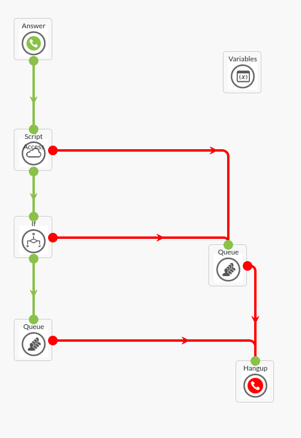

### customer lookups

one example use case of this integration is to add a customer lookup to your dialplan. This can aid in checking
membership, open accounts or tasks assigned or related to a particular user. For example, you could check the
name and email of an existing customer in your own CRM. or you could inform a customer with an outstanding invoice 
that he has one

Moreover, you could also enhance the customer interactions with some tags visible to an agent and or write records
into your CRM or other backoffice system to register contacts
### Dialplan

here you see an example dialplan where a customer is put into one of two queues. This can help 

### example use cases
- AB testing
- customer recognition
- VIP queues
- special queues for customer onboarding