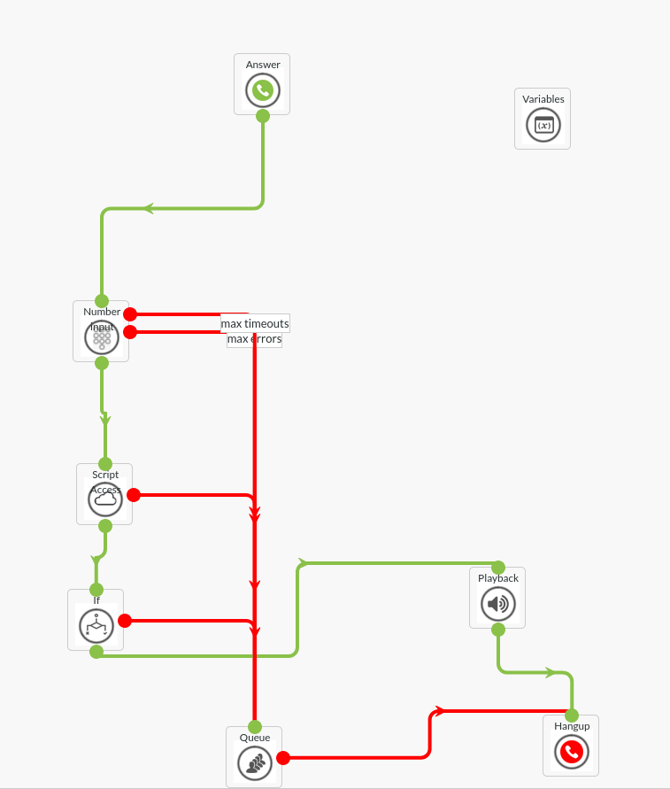

# meter reading

A very common example is for a customer to send you some data during telephony routing via DTMF, this needs to be 
checked within one of your own applications for validity. In this example we're creating a demo lambda function
that will check the validity of a reading of a utility meter. We will accept any value between 1000 and 9000.
keep in mind that we're accepting strings as input. This is because DTMF includes non number characters like '#' and '*'

## dialplan

in this dialplan we play a sound for the customer to give hist meter reading. subsequently we send the string as a 
variable to the lambda function. then we deal with all failure cases by sending the customer into a queue to
resolve the issue with an agent. If this reading is accepted we simply play a sound that indicated the reading was accepted
after which we hangup the customer.

## example use cases
- processing meter reading
- checking outstanding invoices
- checking membership, via relation numbers
- helping customers with their purchase using purchase numbers
- checking the location and status of deliveries, (combine with TTS)