# QuandaGo Interactions Lambda example 

QuandaGo Interactions supports integrations with external systems by calling AWS Lambda
functions. These functions can be used as an RPC style framework for sending and retrieving
arbitrary data. This provides integration between the QuandaGo dialplan and an external system for
e.g. custom data validation, data processing or process automation. To use this you need an active
subscription of QuandaGo interactions. Each subscription comes with a maximum of a few dozen of
active functions. Make sure to deactivate any test or unused functions that you configured before
otherwise there might be a chance that new functions cannot be created.
We have added two examples to this project:

### 1. meterReadingLambda
You could think of this function in the real world as a solution for validating an electricity meter
reading entered into the QuandaGo dialplan by the caller. For example, this meter reading can be
checked for accuracy by the Lambda function in an external system. In our example, this Lambda
returns accepted:true when the entered value is between 1000-9000, otherwise the function returns
accepted:false.

### 2. customerLookupLamda
You could think of this function in the real world as a solution to look up a name associated with a
phone number. As a phone number, you can use the QuandaGo Caller ID number. Then this lambda
function is used to look up the name in an external CRM database. The name can then be linked to a
tag in the dial plan for further use in e.g. the Agent Desktop. In our example the function always
returns Bob Bauer

## creating the lambda function

Before you can use the Lambda function you have to configure it with some very specific
prerequisites. This includes creating the Lambda function, the Lambda function role and the role in
your AWS account that allows QuandaGo to invoke the Lambda function. We've included in this
demo a set of cloud formation templates that will configure all those resources for you. To use them
go to CloudFormation in your AWS account.

### cloud formation

First upload the example YAML stack template from one of the *example* folder.

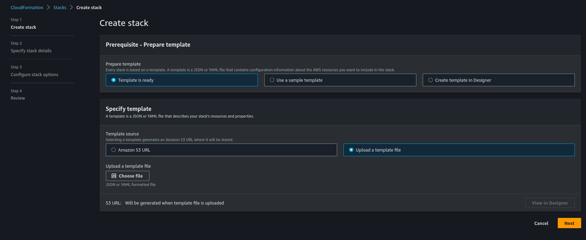

You need to fill in the parameters, most of these will be auto filled except for your tenant GUID. The
tenant GUID can be retrieved from the QuandaGo Interactions Manager application under

*manaement > tenants*

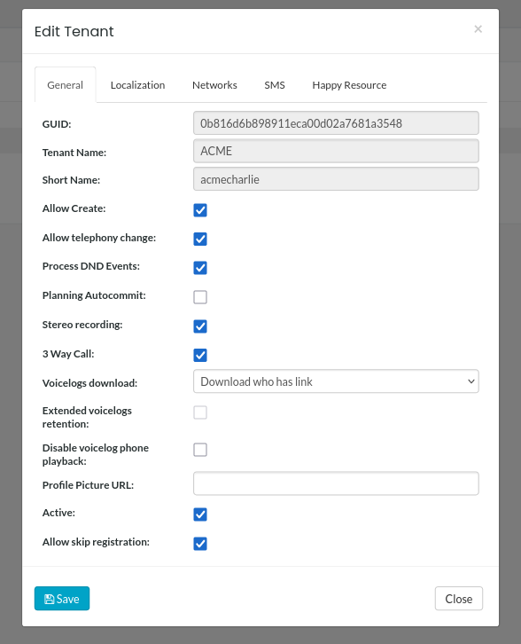

Add this as tenant GUID in the CloudFormation configuration window to create a cloud formation stack.

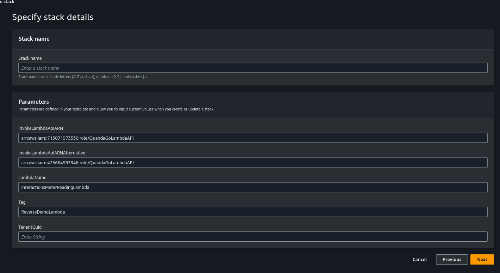

Once this is created we will need the resource ids in the next step.
### interactions configuration

In order to use the created function in the QuandaGo Dialplan you have to configure the created
Lambda, both it's id (ARN) and the id (ARN) of the role you to give access to the function in your
account. You can do this in the QuandaGo Manager application under management > lambda
functions. Optionally you can also configure input and output parameters.

*make sure to use the AssumeRole and not the ExecutionRole*

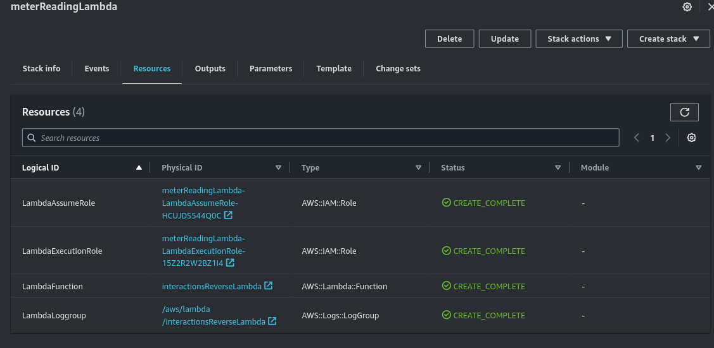

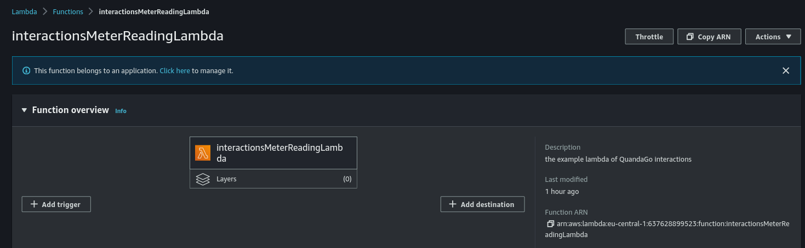

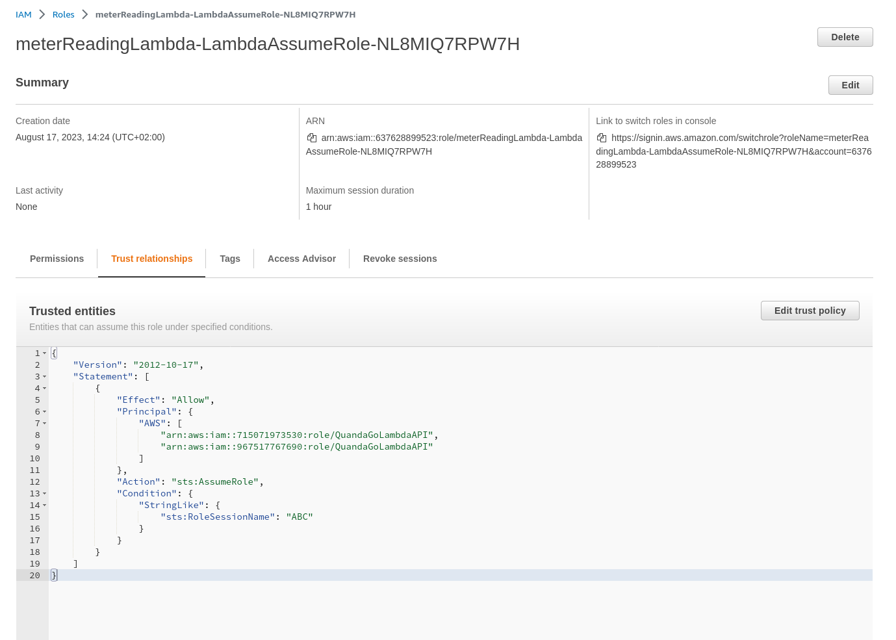

Use the ARN of the assume role and of the Lambda to configure a new Lambda function in
*management > lambda functions* within QuandaGo Interactions.

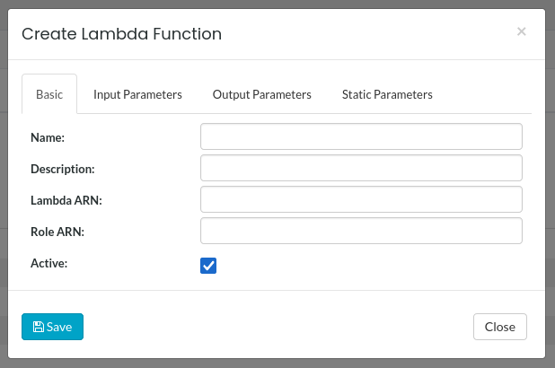

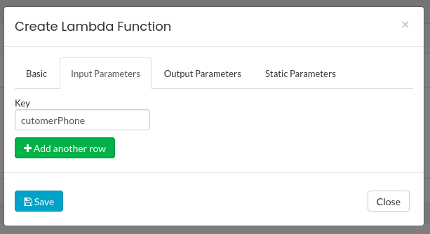

Optionally you can also configure input and output for this particular Lambda function. Because
these calls can fail both as an communication error and as an application level error, such as not
found etc. We recommend to always return and check some kind of error code as an output

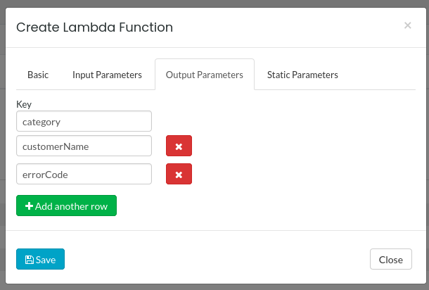

### configuration in dialplan

Under *telephony > routing* "+ add visual dialplan" you can drag a "script access" and "variables" block
into the Dialplan . You will notice that you can now use the previously configured Lambda function in
the "script access" block, with the defined input and output. You should define a variable with an
initial value. There should also be explicit assignments when using runtime variables like caller id as
part of your script input.

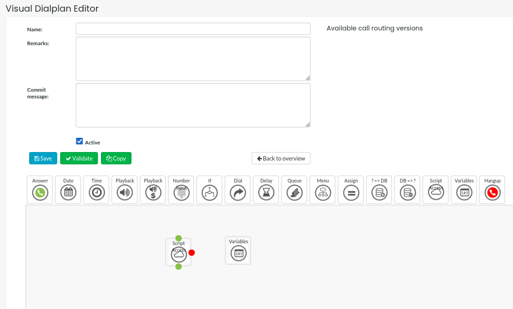

If you've added some inputs and conditional outputs to your function the dialplan should look
something like this.

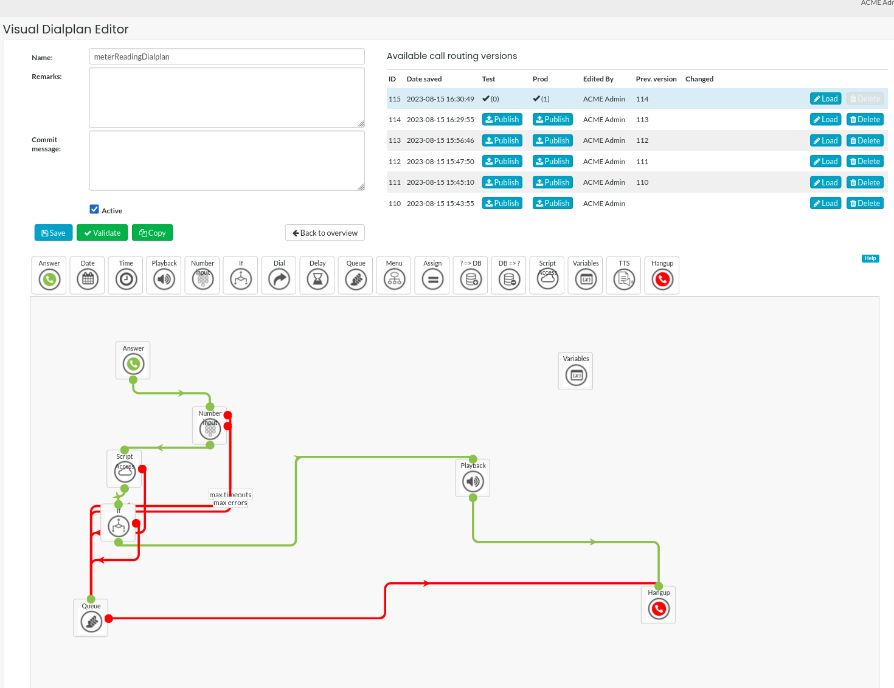

### assign dialplan to phone number

After creating, saving and publishing the dialplan you should pick a phone number and assign it.

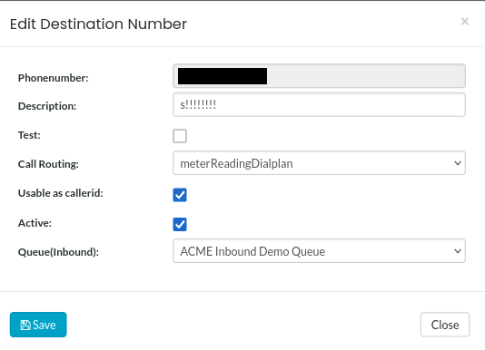

You can test your Lambda integration by calling the phone number you just configured.
